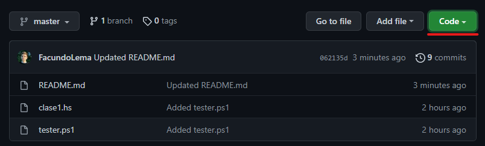
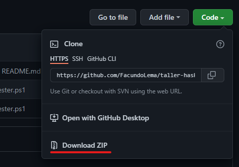

# Taller de Algebra I #

## Test de funciones ###

**Tester** es un script (no oficial) para verificar la validez de las funciones dadas como tarea en cada clase del taller de Algebra I. Lo unico que hace **Tester** es ejecutar las funciones con diferentes parámetros y verificar si la respuesta es la esperada. **Tester** viene en cinco formas distintas, dependiendo la plataforma en la que se quiera utilizar:
- **PowerShell** (Windows 7 / 8 / 10 / 11, PowerShell Core 6 / 7)
- **Batch** (Windows) [en proceso]
- **Bash** (Linux, macOS, *nix) [en proceso]
- **ZSH** (macOS, zsh users) [en proceso]
- **Ejecutable (C)** (ver *releases*) [en proceso]

### ¿Cómo lo descargo? ###

**GIT**
```
git clone https://github.com/FacundoLema/taller-haskell.git
cd taller-haskell
rm -r clases
rm -r img
```
**Como ZIP desde GitHub**

1. Hace click en el botón "Code" arriba a la derecha



2. Hace click en "Download ZIP"



3. Hace lick derecho en *taller-haskell.zip* en la carpeta de descargas.
4. Descomprimí el archivo (unzip, extract)
5. Eliminá las carpetas *clases* y *img* *(opcional)*

### ¿Como lo uso? ###
- Copiá y pegá en la carpeta *(taller-haskell)* el archivo de Haskell que quieras chequear.

**Método 1 - Windows (GUI)**
- Hacé doble click sobre *tester.ps1*
- Si hacer doble click no abre la terminal, click derecho sobre *tester.ps1* y elegí *"Run with PowerShell"*
- Una vez iniciado el script, te va a pedir el nombre del archivo que acabas de pegar en la carpeta.Tenes que pasarle el nombre del archivo tal cual figura en tu computadora, incluida la extension (.hs).Tené en cuenta que se distingue entre mayúsculas y minúsculas.
- Una vez provisto el nombre del archivo, te va a pedir el número de la clase a la cual corresponden losejercicios. Acá solo tenes que ingresar el número correspondiente.*
- Tené en cuenta que este metodo **no** funciona si tus funciones estan declaradas dentro de un módulo.Para chequear funciones declaradas dentro de módulos, usá el metodo 2.

**Método 2 - command line**
- Abrí la terminal **(PowerShell)**** y navegá a *taller-algebra*.

**Tester** *(tester.ps1)* toma dos argumentos, ***-archivo*** y ***-clase***. Adicionalmente, se puede especificaruna flag: ***-module***
- ***-archivo*** corresponde al nombre del archivo de Haskell que copiaste y pegaste en la carpeta,incluida su extensión (.hs). 
- ***-clase*** corresponde al número de la clase a la cual corresponden los ejercicios. Solo aceptanúmeros (int).*
- ***-module***, ***-m*** es una flag obligatoria si las funciones estan definidas dentro de unmódulo (es decir, si al comienzo de tu archivo escribiste *module ModuleName where*). Es importanteque el nombre del módulo comience con mayúscula (requisito de Haskell) y que el nombre del módulo seaexactamente igual al nombre del archivo.

Ejecutá, reemplazando por el nombre de tu archivo y el número de clase:
```
.\tester.ps1 -archivo archivo.hs -clase n
```
O, si tus funciones están definidas dentro de un módulo:
```
.\tester.ps1 -archivo archivo.hs -clase n -m
````

\* Si tu archivo se llama *clase1.hs* o algo por el estilo, quizás te prenguntes por qué no lo deduzco del nombre de tu archivo. La respuesta es que, si bien me parece buena práctica usar *claseN.hs* como nombre de archivo, no tengo idea de que nombres usaran los demás y el script tiene que funcionar tanto para *clase1.hs* como para *foo.hs*, dado que *foo.hs* sea un archivo que contenga las funciones correspondientes a la clase 1. \
\** Si usas Windows 10 / 11, usá **Windows Terminal** con PowerShell.